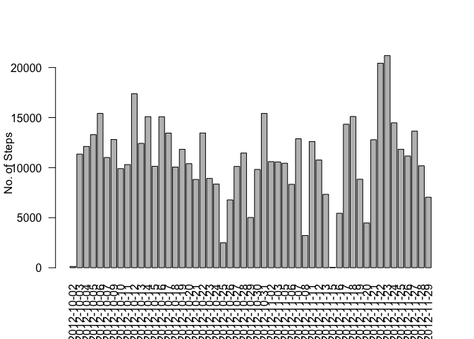
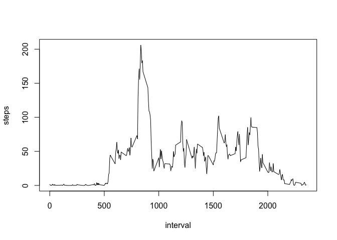
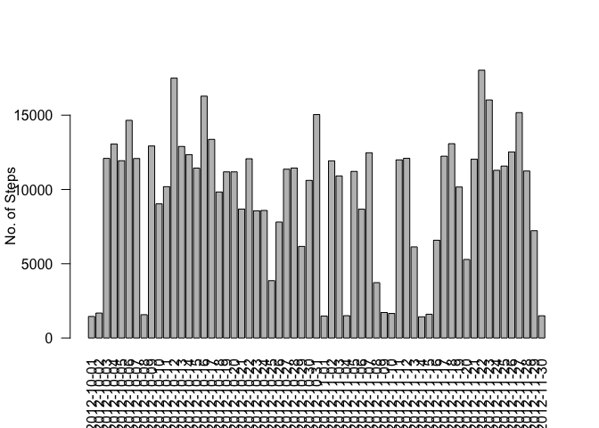
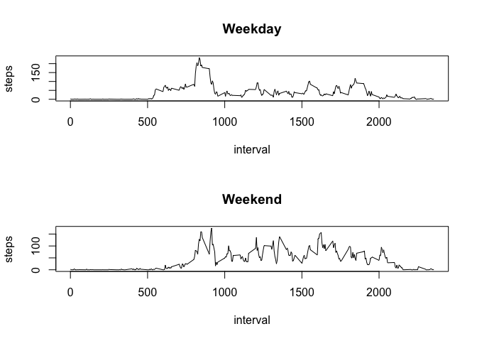

# Reproducible Research: Peer Assessment 1


## Loading and preprocessing the data

```r
unzip('activity.zip')
activityData <- read.csv(file="activity.csv")
```


## What is mean total number of steps taken per day?
### Make a histogram of the total number of steps taken each day

```r
stepsData<- aggregate(steps ~ date, data = activityData, FUN=sum)
barplot(stepsData$steps, names.arg=stepsData$date, ylab='No. of Steps',las=2)
```

 

### Calculate and report the mean and median total number of steps taken per day

The mean number of steps taken per days is:

```r
mean(stepsData$steps)
```

```
## [1] 10766.19
```

The median number of steps taken per days is:

```r
median(stepsData$steps)
```

```
## [1] 10765
```

## What is the average daily activity pattern?

### Make a time series plot (i.e. type = "l") of the 5-minute interval (x-axis)
### and the average number of steps taken, averaged across all days (y-axis)


```r
stepsData.interval <- aggregate(steps ~ interval, data = activityData, FUN=mean)
plot(stepsData.interval,type="l")
```

 

### Which 5-minute interval, on average across all the days in the dataset,
### contains the maximum number of steps?


```r
stepsData.interval$interval[which.max(stepsData.interval$steps)]
```

```
## [1] 835
```

## Imputing missing values

### Calculate and report the total number of missing values in the dataset
sum(is.na(avtivityData))

### Devise a strategy for filling in all of the missing values in the dataset. The
### strategy does not need to be sophisticated. 

### Mean for 5-minute interval will be used as fillers

```r
imputedActivityData <- activityData
imputedActivityData <- merge(activityData, stepsData.interval, by="interval", suffixes=c("",".temp"))
imputedActivityData$steps[is.na(activityData$steps)] <- imputedActivityData$steps.temp[is.na(activityData$steps)]
```

### Create a new dataset that is equal to the original dataset but with the
### missing data filled in.

```r
imputedActivityData <- imputedActivityData[,1:3]
```

### Make a histogram of the total number of steps taken each day

```r
stepsData.date <- aggregate(steps ~ date, data = imputedActivityData, FUN = sum)
barplot(stepsData.date$steps, names.arg=stepsData.date$date, ylab='No. of Steps',las=2)
```

 

### Calculate and report the mean and median total number of steps taken per day.

The mean number of steps taken per days is:

```r
mean(stepsData.date$steps)
```

```
## [1] 9563.93
```

The median number of steps taken per days is:

```r
median(stepsData.date$steps)
```

```
## [1] 11215.68
```

### Do these values differ from the estimates from the first part of the assignment?
### What is the impact of imputing missing data on the estimates of the total
### daily number of steps?

Yes, there is a difference. The number of steps is not biased anymore by missing values. The mean number of steps has decreased from before, whereas the median has increased.

## Are there differences in activity patterns between weekdays and weekends?

### Create a new factor variable in the dataset with two levels – “weekday”
### and “weekend” indicating whether a given date is a weekday or weekend day.


```r
typeOfDay <- function(date) {
    if (weekdays(as.Date(date)) %in% c("Monday", "Tuesday","Wednesday","Thursday","Friday"))
        return("Weekday")
    else
        return("Weekend")
}
imputedActivityData$typeOfDay <- as.factor(sapply(imputedActivityData$date, typeOfDay))
```

### Make a panel plot containing a time series plot (i.e. type = "l") of the
### 5-minute interval (x-axis) and the average number of steps taken, averaged
### across all weekday days or weekend days (y-axis).


```r
stepsData.Weekday <- aggregate(steps ~ interval, data = imputedActivityData, 
    subset = imputedActivityData$typeOfDay == "Weekday", FUN = mean)

stepsData.Weekend <- aggregate(steps ~ interval, data = imputedActivityData, 
    subset = imputedActivityData$typeOfDay == "Weekend", FUN = mean)

par(mfrow=c(2,1))

plot(stepsData.Weekday, type = "l", main = "Weekday")
plot(stepsData.Weekend, type = "l", main = "Weekend")
```

 
